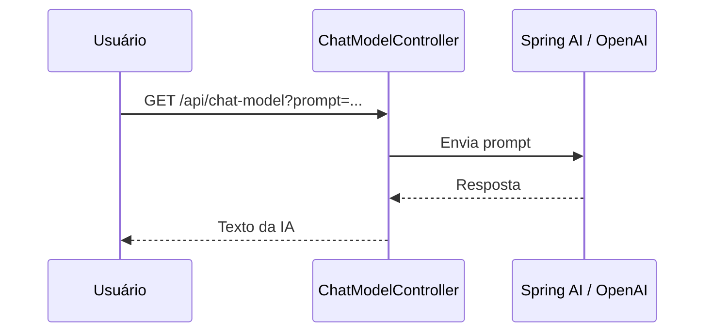
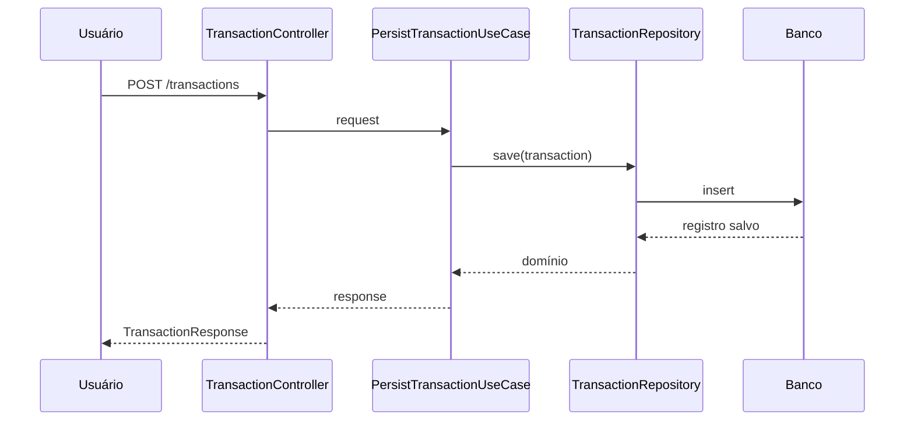
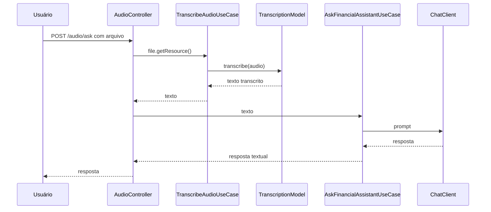

# README Técnico — API Inteligente com Reconhecimento de Fala e Spring Boot

**Data de elaboração:** 18/05/2026  
**Projeto-base:** Bootcamp DIO — Java / Spring Boot / IA  
**Nome sugerido do projeto:** `budgeting`  
**Objetivo:** documentar a arquitetura, as classes, os pacotes e o roadmap evolutivo de uma API inteligente com Spring Boot, Spring AI e OpenAI.

---

## 1. Entendimento do Desafio

O desafio propõe a construção de uma API Java com Spring Boot capaz de usar inteligência artificial para interagir com o usuário por texto e, evolutivamente, por voz.

A ideia central é criar um assistente inteligente de orçamento/transações, onde o usuário pode:

1. Enviar uma pergunta em texto para um endpoint REST.
2. Receber uma resposta gerada por um modelo de IA.
3. Enviar um áudio para a API.
4. Transcrever o áudio para texto.
5. Processar esse texto com IA.
6. Registrar ou consultar transações financeiras.
7. Evoluir o projeto para persistência real, segurança, conectividade externa, arquitetura desacoplada, MCP Server e microsserviços especializados de áudio.

Este projeto não deve ser tratado apenas como uma chamada HTTP simples para a OpenAI. O ideal é usar o ecossistema Spring Boot:

- `Spring Web`
- `Spring AI`
- `Spring Data JPA`
- `Spring Security`
- `JWT`
- `OpenFeign`
- `Bean Validation`
- `Controller`
- `Use Cases`
- `DTOs`
- `Repository`
- `Exception Handler`
- Configuração por `application.properties`

---

## 2. Escopo do MVP

O MVP deve entregar uma API funcional com três blocos principais:

### 2.1 Chat textual com IA

Endpoint simples para enviar uma pergunta e receber uma resposta:

```http
GET /api/chat-model?prompt=Como posso economizar mais este mês?
```

Fluxo:

```text
Usuário
  ↓
ChatModelController
  ↓
ChatClient / Spring AI
  ↓
OpenAI Chat Model
  ↓
Resposta textual
```

---

### 2.2 Cadastro e consulta de transações

Endpoints para registrar e consultar transações financeiras.

Exemplos:

```http
POST /transactions
GET /transactions/{category}
```

Fluxo:

```text
TransactionController
  ↓
PersistTransactionUseCase
  ↓
TransactionRepository
  ↓
Banco de dados
```

---

### 2.3 Reconhecimento de fala

Endpoint para upload de áudio:

```http
POST /transactions/ai
Content-Type: multipart/form-data
file=<audio>
```

Fluxo esperado:

```text
Arquivo de áudio
  ↓
TransactionController ou AudioController
  ↓
TranscriptionModel
  ↓
Texto transcrito
  ↓
ChatClient
  ↓
IA interpreta o comando
  ↓
Use Case registra ou consulta transações
  ↓
Opcional: TextToSpeechModel gera áudio de resposta
```

---

## 3. Roadmap Interpretado a partir das Imagens

A imagem do roadmap mostra a evolução “Da Prova de Conceito à Escala Real”. Abaixo está a leitura organizada em fases técnicas.

---

### Fase 1 — Prova de Conceito com ChatModel

**Objetivo:** validar o uso do Spring AI com OpenAI.

Entregas:

- Criar projeto Spring Boot.
- Configurar `OPENAI_API_KEY`.
- Criar endpoint `/api/chat-model`.
- Usar `ChatClient` ou `ChatModel`.
- Retornar resposta simples em texto.

Classes principais:

- `BudgetingApplication`
- `ChatModelController`

---

### Fase 2 — Persistência e Integração Real

**Objetivo:** sair do protótipo e persistir dados de verdade.

Entregas:

- Criar entidade de domínio `Transaction`.
- Criar DTOs de entrada e saída.
- Criar `PersistTransactionUseCase`.
- Criar `ListTransactionsByCategoryUseCase`.
- Criar repositório com Spring Data JPA.
- Usar banco relacional no início.
- Opcionalmente migrar ou integrar MongoDB para cenários de alto volume.

Classes principais:

- `Transaction`
- `TransactionRequest`
- `TransactionResponse`
- `TransactionController`
- `PersistTransactionUseCase`
- `ListTransactionsByCategoryUseCase`
- `TransactionRepository`
- `TransactionJpaRepository`
- `TransactionPersistenceAdapter`

---

### Fase 3 — Reconhecimento de Fala

**Objetivo:** permitir que o usuário fale com a aplicação.

Entregas:

- Criar endpoint multipart para upload de áudio.
- Receber `MultipartFile`.
- Usar `TranscriptionModel`.
- Transformar áudio em texto.
- Enviar o texto transcrito para o `ChatClient`.

Classes principais:

- `AudioController` ou método específico em `TransactionController`
- `TranscribeAudioUseCase`
- `SpringAiAudioTranscriptionGateway`

---

### Fase 4 — Text-to-Speech

**Objetivo:** transformar a resposta da IA em áudio.

Entregas:

- Usar `TextToSpeechModel`.
- Criar serviço para sintetizar fala.
- Retornar `audio/mpeg` ou salvar o arquivo gerado.
- Separar a lógica em um gateway para não acoplar o domínio ao Spring AI.

Classes principais:

- `SpeechSynthesisGateway`
- `SpringAiSpeechSynthesisGateway`
- `SynthesizeSpeechUseCase`

---

### Fase 5 — Segurança com Spring Security e JWT

**Objetivo:** proteger os endpoints e permitir múltiplos usuários.

Entregas:

- Autenticação com usuário/senha ou outro mecanismo.
- Geração de JWT.
- Filtro de autenticação.
- Proteção de endpoints.
- Associação de transações ao usuário autenticado.

Classes principais:

- `SecurityConfig`
- `JwtService`
- `JwtAuthenticationFilter`
- `User`
- `UserRepository`
- `AuthenticationController`
- `AuthenticationRequest`
- `AuthenticationResponse`

---

### Fase 6 — Conectividade Externa com Feign

**Objetivo:** permitir integração com serviços externos.

Possíveis integrações:

- Serviço antifraude.
- Serviço de conversão de moedas.
- Serviço externo de categorização.
- Serviço externo de enriquecimento financeiro.

Classes principais:

- `AntiFraudClient`
- `CurrencyExchangeClient`
- `ExternalValidationGateway`
- `FeignConfig`

---

### Fase 7 — Arquitetura Distribuída e Independente

**Objetivo:** preparar o projeto para crescimento.

Entregas:

- Separar domínio, aplicação e infraestrutura.
- Evitar regra de negócio dentro do controller.
- Evitar acoplamento direto do domínio ao Spring AI.
- Criar portas e adaptadores.
- Preparar extração futura para microsserviços.

Camadas:

```text
domain
application
infrastructure
config
```

---

### Fase 8 — Desacoplamento com MCP Server

**Objetivo:** isolar a lógica de negócio e preparar integração com Model Context Protocol.

Leitura técnica do roadmap:

```text
Lógica de Negócio / Use Cases
  ↓
MCP Server
  ↓
IA / Ferramentas / Contexto
```

A ideia é que a IA não conheça diretamente o banco, nem as regras internas da aplicação. Ela deveria chamar ferramentas controladas, como:

- `registrar_transacao`
- `listar_transacoes_por_categoria`
- `consultar_saldo`
- `resumir_gastos`
- `converter_moeda`
- `validar_transacao`

Classes futuras:

- `McpToolController`
- `McpTransactionTool`
- `McpServerConfig`
- `FinancialToolRegistry`

---

### Fase 9 — Microsserviços de Áudio Especializados

**Objetivo:** delegar transcrição e TTS para serviços isolados.

Roadmap visual:

```text
Spring Boot API
  ↓ HTTP/JSON
Transcrição em Python

Spring Boot API
  ↓ HTTP/JSON
TTS em Python
```

Possível arquitetura:

```text
budgeting-api
  ├── transações
  ├── segurança
  ├── chat
  └── integração HTTP

audio-transcription-service
  └── Python / Whisper / OpenAI / outro modelo

audio-tts-service
  └── Python / TTS / OpenAI / outro modelo
```

Classes Java para consumir esses microsserviços:

- `TranscriptionFeignClient`
- `TextToSpeechFeignClient`
- `RemoteAudioTranscriptionGateway`
- `RemoteSpeechSynthesisGateway`

---

### Fase 10 — Domínio Puro e Independência

**Objetivo:** manter o centro do sistema independente de frameworks.

Regra fundamental:

> O domínio não deve depender de Spring, OpenAI, banco de dados, HTTP, Feign ou qualquer framework externo.

O domínio deve conhecer apenas:

- Entidades
- Value Objects
- Enums
- Regras de negócio
- Interfaces/portas

Exemplo:

```text
domain.Transaction
domain.Category
domain.TransactionType
domain.TransactionRepository
```

---

## 4. Arquitetura Recomendada de Pacotes

Estrutura sugerida:

```text
src/main/java/io/budgeting
├── BudgetingApplication.java
│
├── application
│   ├── usecase
│   │   ├── AskFinancialAssistantUseCase.java
│   │   ├── InterpretTransactionUseCase.java
│   │   ├── PersistTransactionUseCase.java
│   │   ├── ListTransactionsByCategoryUseCase.java
│   │   ├── TranscribeAudioUseCase.java
│   │   └── SynthesizeSpeechUseCase.java
│   │
│   └── port
│       ├── FinancialAssistantGateway.java
│       ├── AudioTranscriptionGateway.java
│       ├── SpeechSynthesisGateway.java
│       ├── ExternalValidationGateway.java
│       └── TransactionRepository.java
│
├── domain
│   ├── Transaction.java
│   ├── Category.java
│   ├── TransactionType.java
│   └── Money.java
│
├── infrastructure
│   ├── http
│   │   ├── ChatModelController.java
│   │   ├── TransactionController.java
│   │   ├── AudioController.java
│   │   ├── GlobalExceptionHandler.java
│   │   ├── request
│   │   │   ├── TransactionRequest.java
│   │   │   ├── ChatRequest.java
│   │   │   └── AuthenticationRequest.java
│   │   └── response
│   │       ├── TransactionResponse.java
│   │       ├── ChatResponse.java
│   │       └── AuthenticationResponse.java
│   │
│   ├── persistence
│   │   ├── TransactionJpaEntity.java
│   │   ├── TransactionJpaRepository.java
│   │   └── TransactionPersistenceAdapter.java
│   │
│   ├── ai
│   │   └── openai
│   │       ├── SpringAiFinancialAssistantGateway.java
│   │       ├── SpringAiAudioTranscriptionGateway.java
│   │       └── SpringAiSpeechSynthesisGateway.java
│   │
│   ├── external
│   │   ├── AntiFraudClient.java
│   │   ├── CurrencyExchangeClient.java
│   │   └── FeignConfig.java
│   │
│   └── security
│       ├── SecurityConfig.java
│       ├── JwtService.java
│       └── JwtAuthenticationFilter.java
│
└── config
    ├── OpenAiConfig.java
    └── ApplicationConfig.java
```

---

## 5. Dependências Sugeridas

### 5.1 Maven

Exemplo de dependências principais:

```xml
<dependencies>
    <!-- API REST -->
    <dependency>
        <groupId>org.springframework.boot</groupId>
        <artifactId>spring-boot-starter-web</artifactId>
    </dependency>

    <!-- Spring AI com OpenAI -->
    <dependency>
        <groupId>org.springframework.ai</groupId>
        <artifactId>spring-ai-starter-model-openai</artifactId>
    </dependency>

    <!-- Persistência relacional -->
    <dependency>
        <groupId>org.springframework.boot</groupId>
        <artifactId>spring-boot-starter-data-jpa</artifactId>
    </dependency>

    <!-- Banco em memória para desenvolvimento -->
    <dependency>
        <groupId>com.h2database</groupId>
        <artifactId>h2</artifactId>
        <scope>runtime</scope>
    </dependency>

    <!-- Validação -->
    <dependency>
        <groupId>org.springframework.boot</groupId>
        <artifactId>spring-boot-starter-validation</artifactId>
    </dependency>

    <!-- Segurança -->
    <dependency>
        <groupId>org.springframework.boot</groupId>
        <artifactId>spring-boot-starter-security</artifactId>
    </dependency>

    <!-- Feign -->
    <dependency>
        <groupId>org.springframework.cloud</groupId>
        <artifactId>spring-cloud-starter-openfeign</artifactId>
    </dependency>

    <!-- Testes -->
    <dependency>
        <groupId>org.springframework.boot</groupId>
        <artifactId>spring-boot-starter-test</artifactId>
        <scope>test</scope>
    </dependency>
</dependencies>
```

Observação: a versão do Spring AI deve ser controlada via BOM compatível com a versão do Spring Boot usada no projeto.

---

## 6. Configuração do `application.properties`

Exemplo seguro:

```properties
spring.application.name=budgeting

# OpenAI / Spring AI
spring.ai.openai.api-key=${OPENAI_API_KEY}
spring.ai.openai.chat.options.model=gpt-4o-mini
spring.ai.openai.chat.options.response-format.type=TEXT

# Transcrição de áudio
spring.ai.model.audio.transcription=openai
spring.ai.openai.audio.transcription.options.model=whisper-1
spring.ai.openai.audio.transcription.options.response-format=text
spring.ai.openai.audio.transcription.options.language=pt

# Text-to-Speech
spring.ai.model.audio.speech=openai
spring.ai.openai.audio.speech.options.voice=alloy

# Upload de arquivos
spring.servlet.multipart.max-file-size=10MB
spring.servlet.multipart.max-request-size=10MB

# H2 para desenvolvimento
spring.datasource.url=jdbc:h2:mem:budgeting
spring.datasource.driver-class-name=org.h2.Driver
spring.datasource.username=sa
spring.datasource.password=

spring.jpa.hibernate.ddl-auto=update
spring.h2.console.enabled=true
```

Nunca grave a chave real da OpenAI diretamente no arquivo. Use sempre variável de ambiente:

```bash
export OPENAI_API_KEY="sua-chave"
```

No Windows PowerShell:

```powershell
$env:OPENAI_API_KEY="sua-chave"
```

---

## 7. Definição das Classes

---

## 7.1 `BudgetingApplication`

### Responsabilidade

Classe principal da aplicação Spring Boot.

### Exemplo

```java
package io.budgeting;

import org.springframework.boot.SpringApplication;
import org.springframework.boot.autoconfigure.SpringBootApplication;
import org.springframework.cloud.openfeign.EnableFeignClients;

@SpringBootApplication
@EnableFeignClients
public class BudgetingApplication {

    public static void main(String[] args) {
        SpringApplication.run(BudgetingApplication.class, args);
    }
}
```

### Observação

`@EnableFeignClients` só é necessário quando a fase de conectividade externa com Feign for implementada.

---

## 7.2 `ChatModelController`

### Responsabilidade

Expor endpoint simples para testar o Chat Model da OpenAI via Spring AI.

### Endpoint

```http
GET /api/chat-model?prompt=...
```

### Exemplo

```java
package io.budgeting.infrastructure.http;

import org.springframework.ai.chat.client.ChatClient;
import org.springframework.web.bind.annotation.GetMapping;
import org.springframework.web.bind.annotation.RequestParam;
import org.springframework.web.bind.annotation.RequestMapping;
import org.springframework.web.bind.annotation.RestController;

@RestController
@RequestMapping("/api")
public class ChatModelController {

    private final ChatClient chatClient;

    public ChatModelController(ChatClient.Builder chatClientBuilder) {
        this.chatClient = chatClientBuilder.build();
    }

    @GetMapping("/chat-model")
    public String chat(@RequestParam String prompt) {
        return chatClient
                .prompt()
                .user(prompt)
                .call()
                .content();
    }
}
```

### Papel no projeto

Essa classe é a prova de conceito inicial. Ela valida:

- Spring Boot funcionando.
- Spring AI configurado.
- Chave da OpenAI carregada.
- Modelo respondendo corretamente.

---

## 7.3 `TransactionController`

### Responsabilidade

Receber requisições HTTP relacionadas a transações.

### Endpoints sugeridos

```http
POST /transactions
GET /transactions/{category}
POST /transactions/ai
```

### Exemplo

```java
package io.budgeting.infrastructure.http;

import io.budgeting.application.usecase.ListTransactionsByCategoryUseCase;
import io.budgeting.application.usecase.PersistTransactionUseCase;
import io.budgeting.infrastructure.http.request.TransactionRequest;
import io.budgeting.infrastructure.http.response.TransactionResponse;
import jakarta.validation.Valid;
import org.springframework.http.MediaType;
import org.springframework.web.bind.annotation.*;
import org.springframework.web.multipart.MultipartFile;

import java.util.List;

@RestController
@RequestMapping("/transactions")
public class TransactionController {

    private final PersistTransactionUseCase persistTransactionUseCase;
    private final ListTransactionsByCategoryUseCase listTransactionsByCategoryUseCase;

    public TransactionController(
            PersistTransactionUseCase persistTransactionUseCase,
            ListTransactionsByCategoryUseCase listTransactionsByCategoryUseCase
    ) {
        this.persistTransactionUseCase = persistTransactionUseCase;
        this.listTransactionsByCategoryUseCase = listTransactionsByCategoryUseCase;
    }

    @PostMapping
    public TransactionResponse create(@RequestBody @Valid TransactionRequest request) {
        return persistTransactionUseCase.execute(request);
    }

    @GetMapping("/{category}")
    public List<TransactionResponse> readTransactions(@PathVariable String category) {
        return listTransactionsByCategoryUseCase.execute(category);
    }

    @PostMapping(value = "/ai", consumes = MediaType.MULTIPART_FORM_DATA_VALUE)
    public String transcribe(@RequestParam("file") MultipartFile file) {
        // Evolução: delegar para TranscribeAudioUseCase e ChatClient.
        return "Endpoint reservado para transcrição e interpretação por IA.";
    }
}
```

### Papel no projeto

O controller não deve conter regra de negócio. Ele apenas:

- Recebe HTTP.
- Valida entrada.
- Chama use cases.
- Retorna DTOs.

---

## 7.4 `TransactionRequest`

### Responsabilidade

Representar os dados de entrada para criação de uma transação.

### Exemplo

```java
package io.budgeting.infrastructure.http.request;

import jakarta.validation.constraints.NotBlank;
import jakarta.validation.constraints.NotNull;
import jakarta.validation.constraints.Positive;

import java.math.BigDecimal;

public record TransactionRequest(
        @NotBlank String description,
        @NotNull @Positive BigDecimal amount,
        @NotBlank String category,
        @NotBlank String type
) {
}
```

### Campos

| Campo | Tipo | Descrição |
|---|---|---|
| `description` | `String` | Descrição da transação |
| `amount` | `BigDecimal` | Valor financeiro |
| `category` | `String` | Categoria da transação |
| `type` | `String` | Tipo: receita ou despesa |

---

## 7.5 `TransactionResponse`

### Responsabilidade

Representar os dados de saída de uma transação.

### Exemplo

```java
package io.budgeting.infrastructure.http.response;

import java.math.BigDecimal;
import java.time.LocalDateTime;

public record TransactionResponse(
        Long id,
        String description,
        BigDecimal amount,
        String category,
        String type,
        LocalDateTime createdAt
) {
}
```

---

## 7.6 `Transaction`

### Responsabilidade

Entidade de domínio principal.

### Exemplo

```java
package io.budgeting.domain;

import java.math.BigDecimal;
import java.time.LocalDateTime;

public class Transaction {

    private Long id;
    private String description;
    private BigDecimal amount;
    private Category category;
    private TransactionType type;
    private LocalDateTime createdAt;

    public Transaction(
            Long id,
            String description,
            BigDecimal amount,
            Category category,
            TransactionType type,
            LocalDateTime createdAt
    ) {
        if (amount == null || amount.compareTo(BigDecimal.ZERO) <= 0) {
            throw new IllegalArgumentException("O valor da transação deve ser positivo.");
        }

        this.id = id;
        this.description = description;
        this.amount = amount;
        this.category = category;
        this.type = type;
        this.createdAt = createdAt == null ? LocalDateTime.now() : createdAt;
    }

    public Long getId() {
        return id;
    }

    public String getDescription() {
        return description;
    }

    public BigDecimal getAmount() {
        return amount;
    }

    public Category getCategory() {
        return category;
    }

    public TransactionType getType() {
        return type;
    }

    public LocalDateTime getCreatedAt() {
        return createdAt;
    }
}
```

---

## 7.7 `Category`

### Responsabilidade

Representar as categorias aceitas no domínio.

### Exemplo

```java
package io.budgeting.domain;

public enum Category {
    FOOD,
    TRANSPORT,
    HOUSING,
    HEALTH,
    EDUCATION,
    ENTERTAINMENT,
    SALARY,
    OTHER
}
```

---

## 7.8 `TransactionType`

### Responsabilidade

Representar se a transação é entrada ou saída de dinheiro.

### Exemplo

```java
package io.budgeting.domain;

public enum TransactionType {
    INCOME,
    EXPENSE
}
```

---

## 7.9 `TransactionRepository`

### Responsabilidade

Porta de persistência do domínio/aplicação.

### Exemplo

```java
package io.budgeting.application.port;

import io.budgeting.domain.Category;
import io.budgeting.domain.Transaction;

import java.util.List;

public interface TransactionRepository {

    Transaction save(Transaction transaction);

    List<Transaction> findByCategory(Category category);
}
```

### Observação

Essa interface não deve depender de Spring Data JPA. Ela é uma porta. A implementação fica na infraestrutura.

---

## 7.10 `PersistTransactionUseCase`

### Responsabilidade

Orquestrar a criação de uma transação.

### Exemplo

```java
package io.budgeting.application.usecase;

import io.budgeting.application.port.TransactionRepository;
import io.budgeting.domain.Category;
import io.budgeting.domain.Transaction;
import io.budgeting.domain.TransactionType;
import io.budgeting.infrastructure.http.request.TransactionRequest;
import io.budgeting.infrastructure.http.response.TransactionResponse;
import org.springframework.stereotype.Service;

import java.time.LocalDateTime;

@Service
public class PersistTransactionUseCase {

    private final TransactionRepository transactionRepository;

    public PersistTransactionUseCase(TransactionRepository transactionRepository) {
        this.transactionRepository = transactionRepository;
    }

    public TransactionResponse execute(TransactionRequest request) {
        var transaction = new Transaction(
                null,
                request.description(),
                request.amount(),
                Category.valueOf(request.category().toUpperCase()),
                TransactionType.valueOf(request.type().toUpperCase()),
                LocalDateTime.now()
        );

        var saved = transactionRepository.save(transaction);

        return new TransactionResponse(
                saved.getId(),
                saved.getDescription(),
                saved.getAmount(),
                saved.getCategory().name(),
                saved.getType().name(),
                saved.getCreatedAt()
        );
    }
}
```

### Papel no projeto

É o ponto correto para regras de aplicação, como:

- Validar categoria.
- Validar tipo.
- Chamar antifraude.
- Persistir.
- Retornar resposta.

---

## 7.11 `ListTransactionsByCategoryUseCase`

### Responsabilidade

Listar transações por categoria.

### Exemplo

```java
package io.budgeting.application.usecase;

import io.budgeting.application.port.TransactionRepository;
import io.budgeting.domain.Category;
import io.budgeting.infrastructure.http.response.TransactionResponse;
import org.springframework.stereotype.Service;

import java.util.List;

@Service
public class ListTransactionsByCategoryUseCase {

    private final TransactionRepository transactionRepository;

    public ListTransactionsByCategoryUseCase(TransactionRepository transactionRepository) {
        this.transactionRepository = transactionRepository;
    }

    public List<TransactionResponse> execute(String category) {
        var domainCategory = Category.valueOf(category.toUpperCase());

        return transactionRepository.findByCategory(domainCategory)
                .stream()
                .map(transaction -> new TransactionResponse(
                        transaction.getId(),
                        transaction.getDescription(),
                        transaction.getAmount(),
                        transaction.getCategory().name(),
                        transaction.getType().name(),
                        transaction.getCreatedAt()
                ))
                .toList();
    }
}
```

---

## 7.12 `TransactionJpaEntity`

### Responsabilidade

Entidade JPA usada apenas pela infraestrutura.

### Exemplo

```java
package io.budgeting.infrastructure.persistence;

import jakarta.persistence.*;

import java.math.BigDecimal;
import java.time.LocalDateTime;

@Entity
@Table(name = "transactions")
public class TransactionJpaEntity {

    @Id
    @GeneratedValue(strategy = GenerationType.IDENTITY)
    private Long id;

    private String description;

    private BigDecimal amount;

    private String category;

    private String type;

    private LocalDateTime createdAt;

    public TransactionJpaEntity() {
    }

    public TransactionJpaEntity(
            Long id,
            String description,
            BigDecimal amount,
            String category,
            String type,
            LocalDateTime createdAt
    ) {
        this.id = id;
        this.description = description;
        this.amount = amount;
        this.category = category;
        this.type = type;
        this.createdAt = createdAt;
    }

    public Long getId() {
        return id;
    }

    public String getDescription() {
        return description;
    }

    public BigDecimal getAmount() {
        return amount;
    }

    public String getCategory() {
        return category;
    }

    public String getType() {
        return type;
    }

    public LocalDateTime getCreatedAt() {
        return createdAt;
    }
}
```

---

## 7.13 `TransactionJpaRepository`

### Responsabilidade

Interface Spring Data JPA.

### Exemplo

```java
package io.budgeting.infrastructure.persistence;

import org.springframework.data.jpa.repository.JpaRepository;

import java.util.List;

public interface TransactionJpaRepository extends JpaRepository<TransactionJpaEntity, Long> {

    List<TransactionJpaEntity> findByCategory(String category);
}
```

---

## 7.14 `TransactionPersistenceAdapter`

### Responsabilidade

Adaptar Spring Data JPA para a porta `TransactionRepository`.

### Exemplo

```java
package io.budgeting.infrastructure.persistence;

import io.budgeting.application.port.TransactionRepository;
import io.budgeting.domain.Category;
import io.budgeting.domain.Transaction;
import io.budgeting.domain.TransactionType;
import org.springframework.stereotype.Component;

import java.util.List;

@Component
public class TransactionPersistenceAdapter implements TransactionRepository {

    private final TransactionJpaRepository jpaRepository;

    public TransactionPersistenceAdapter(TransactionJpaRepository jpaRepository) {
        this.jpaRepository = jpaRepository;
    }

    @Override
    public Transaction save(Transaction transaction) {
        var entity = new TransactionJpaEntity(
                transaction.getId(),
                transaction.getDescription(),
                transaction.getAmount(),
                transaction.getCategory().name(),
                transaction.getType().name(),
                transaction.getCreatedAt()
        );

        var saved = jpaRepository.save(entity);

        return toDomain(saved);
    }

    @Override
    public List<Transaction> findByCategory(Category category) {
        return jpaRepository.findByCategory(category.name())
                .stream()
                .map(this::toDomain)
                .toList();
    }

    private Transaction toDomain(TransactionJpaEntity entity) {
        return new Transaction(
                entity.getId(),
                entity.getDescription(),
                entity.getAmount(),
                Category.valueOf(entity.getCategory()),
                TransactionType.valueOf(entity.getType()),
                entity.getCreatedAt()
        );
    }
}
```

---

## 7.15 `FinancialAssistantGateway`

### Responsabilidade

Porta para comunicação com o modelo de IA.

### Exemplo

```java
package io.budgeting.application.port;

public interface FinancialAssistantGateway {

    String ask(String userMessage);
}
```

---

## 7.16 `SpringAiFinancialAssistantGateway`

### Responsabilidade

Implementar a comunicação com OpenAI via Spring AI.

### Exemplo

```java
package io.budgeting.infrastructure.ai.openai;

import io.budgeting.application.port.FinancialAssistantGateway;
import org.springframework.ai.chat.client.ChatClient;
import org.springframework.stereotype.Component;

@Component
public class SpringAiFinancialAssistantGateway implements FinancialAssistantGateway {

    private final ChatClient chatClient;

    public SpringAiFinancialAssistantGateway(ChatClient.Builder chatClientBuilder) {
        this.chatClient = chatClientBuilder
                .defaultSystem("""
                        Você é um assistente financeiro educativo.
                        Ajude o usuário a registrar, consultar e entender transações.
                        Responda de forma objetiva e segura.
                        Quando identificar uma despesa, tente extrair descrição, valor e categoria.
                        """)
                .build();
    }

    @Override
    public String ask(String userMessage) {
        return chatClient
                .prompt()
                .user(userMessage)
                .call()
                .content();
    }
}
```

---

## 7.17 `AskFinancialAssistantUseCase`

### Responsabilidade

Orquestrar uma pergunta do usuário para o assistente financeiro.

### Exemplo

```java
package io.budgeting.application.usecase;

import io.budgeting.application.port.FinancialAssistantGateway;
import org.springframework.stereotype.Service;

@Service
public class AskFinancialAssistantUseCase {

    private final FinancialAssistantGateway financialAssistantGateway;

    public AskFinancialAssistantUseCase(FinancialAssistantGateway financialAssistantGateway) {
        this.financialAssistantGateway = financialAssistantGateway;
    }

    public String execute(String message) {
        return financialAssistantGateway.ask(message);
    }
}
```

---

## 7.18 `AudioTranscriptionGateway`

### Responsabilidade

Porta para transcrever áudio.

### Exemplo

```java
package io.budgeting.application.port;

import org.springframework.core.io.Resource;

public interface AudioTranscriptionGateway {

    String transcribe(Resource audioResource);
}
```

---

## 7.19 `SpringAiAudioTranscriptionGateway`

### Responsabilidade

Implementar transcrição usando Spring AI e OpenAI.

### Exemplo

```java
package io.budgeting.infrastructure.ai.openai;

import io.budgeting.application.port.AudioTranscriptionGateway;
import org.springframework.ai.audio.transcription.AudioTranscriptionPrompt;
import org.springframework.ai.audio.transcription.TranscriptionModel;
import org.springframework.core.io.Resource;
import org.springframework.stereotype.Component;

@Component
public class SpringAiAudioTranscriptionGateway implements AudioTranscriptionGateway {

    private final TranscriptionModel transcriptionModel;

    public SpringAiAudioTranscriptionGateway(TranscriptionModel transcriptionModel) {
        this.transcriptionModel = transcriptionModel;
    }

    @Override
    public String transcribe(Resource audioResource) {
        var prompt = new AudioTranscriptionPrompt(audioResource);
        return transcriptionModel.call(prompt)
                .getResult()
                .getOutput();
    }
}
```

### Observação

Dependendo da versão do Spring AI, a assinatura do método pode variar. A ideia arquitetural permanece a mesma: o controller não deve conhecer diretamente o modelo de transcrição.

---

## 7.20 `TranscribeAudioUseCase`

### Responsabilidade

Receber um recurso de áudio e devolver texto transcrito.

### Exemplo

```java
package io.budgeting.application.usecase;

import io.budgeting.application.port.AudioTranscriptionGateway;
import org.springframework.core.io.Resource;
import org.springframework.stereotype.Service;

@Service
public class TranscribeAudioUseCase {

    private final AudioTranscriptionGateway audioTranscriptionGateway;

    public TranscribeAudioUseCase(AudioTranscriptionGateway audioTranscriptionGateway) {
        this.audioTranscriptionGateway = audioTranscriptionGateway;
    }

    public String execute(Resource audioResource) {
        return audioTranscriptionGateway.transcribe(audioResource);
    }
}
```

---

## 7.21 `SpeechSynthesisGateway`

### Responsabilidade

Porta para geração de áudio a partir de texto.

### Exemplo

```java
package io.budgeting.application.port;

public interface SpeechSynthesisGateway {

    byte[] synthesize(String text);
}
```

---

## 7.22 `SpringAiSpeechSynthesisGateway`

### Responsabilidade

Implementar TTS com Spring AI.

### Exemplo

```java
package io.budgeting.infrastructure.ai.openai;

import io.budgeting.application.port.SpeechSynthesisGateway;
import org.springframework.ai.audio.speech.TextToSpeechModel;
import org.springframework.stereotype.Component;

@Component
public class SpringAiSpeechSynthesisGateway implements SpeechSynthesisGateway {

    private final TextToSpeechModel textToSpeechModel;

    public SpringAiSpeechSynthesisGateway(TextToSpeechModel textToSpeechModel) {
        this.textToSpeechModel = textToSpeechModel;
    }

    @Override
    public byte[] synthesize(String text) {
        return textToSpeechModel.call(text);
    }
}
```

---

## 7.23 `AudioController`

### Responsabilidade

Expor endpoints dedicados a áudio.

### Exemplo

```java
package io.budgeting.infrastructure.http;

import io.budgeting.application.usecase.AskFinancialAssistantUseCase;
import io.budgeting.application.usecase.TranscribeAudioUseCase;
import org.springframework.http.MediaType;
import org.springframework.web.bind.annotation.*;
import org.springframework.web.multipart.MultipartFile;

@RestController
@RequestMapping("/audio")
public class AudioController {

    private final TranscribeAudioUseCase transcribeAudioUseCase;
    private final AskFinancialAssistantUseCase askFinancialAssistantUseCase;

    public AudioController(
            TranscribeAudioUseCase transcribeAudioUseCase,
            AskFinancialAssistantUseCase askFinancialAssistantUseCase
    ) {
        this.transcribeAudioUseCase = transcribeAudioUseCase;
        this.askFinancialAssistantUseCase = askFinancialAssistantUseCase;
    }

    @PostMapping(value = "/ask", consumes = MediaType.MULTIPART_FORM_DATA_VALUE)
    public String askByAudio(@RequestParam("file") MultipartFile file) {
        try {
            var transcription = transcribeAudioUseCase.execute(file.getResource());
            return askFinancialAssistantUseCase.execute(transcription);
        } catch (Exception e) {
            throw new IllegalArgumentException("Não foi possível processar o áudio.", e);
        }
    }
}
```

---

## 7.24 `GlobalExceptionHandler`

### Responsabilidade

Padronizar erros da API.

### Exemplo

```java
package io.budgeting.infrastructure.http;

import org.springframework.http.HttpStatus;
import org.springframework.http.ProblemDetail;
import org.springframework.web.bind.MethodArgumentNotValidException;
import org.springframework.web.bind.annotation.ExceptionHandler;
import org.springframework.web.bind.annotation.RestControllerAdvice;

@RestControllerAdvice
public class GlobalExceptionHandler {

    @ExceptionHandler(IllegalArgumentException.class)
    public ProblemDetail handleIllegalArgument(IllegalArgumentException ex) {
        var problem = ProblemDetail.forStatus(HttpStatus.BAD_REQUEST);
        problem.setTitle("Requisição inválida");
        problem.setDetail(ex.getMessage());
        return problem;
    }

    @ExceptionHandler(MethodArgumentNotValidException.class)
    public ProblemDetail handleValidation(MethodArgumentNotValidException ex) {
        var problem = ProblemDetail.forStatus(HttpStatus.BAD_REQUEST);
        problem.setTitle("Erro de validação");
        problem.setDetail("Verifique os campos enviados.");
        return problem;
    }
}
```

---

## 8. Fluxos de Uso

---

### 8.1 Fluxo — Chat simples



---

### 8.2 Fluxo — Transação manual



---

### 8.3 Fluxo — Áudio para IA



---

## 9. Prompts Recomendados

### 9.1 Prompt de sistema do assistente financeiro

```text
Você é um assistente financeiro educativo dentro de uma API Spring Boot.
Sua função é ajudar o usuário a registrar, consultar e compreender transações financeiras.

Regras:
1. Seja objetivo.
2. Não invente dados.
3. Se o usuário informar um gasto, tente extrair descrição, valor e categoria.
4. Se faltar informação, peça esclarecimento.
5. Nunca exponha dados sensíveis.
6. Não tome decisões financeiras definitivas pelo usuário.
7. Responda em português do Brasil.
```

---

### 9.2 Prompt para interpretar transação

```text
Extraia da mensagem do usuário uma possível transação financeira.

Retorne somente JSON com os campos:
{
  "description": "",
  "amount": 0,
  "category": "",
  "type": "EXPENSE ou INCOME"
}

Mensagem:
{mensagem_usuario}
```

---

## 10. Definition of Done

O projeto pode ser considerado entregue no MVP quando:

- A aplicação sobe com `mvn spring-boot:run`.
- A chave da OpenAI é lida por variável de ambiente.
- O endpoint `/api/chat-model` responde usando IA.
- O endpoint de transações cadastra dados.
- O endpoint de consulta por categoria retorna transações.
- O endpoint de áudio recebe `MultipartFile`.
- A transcrição é delegada para uma classe específica.
- As regras de negócio não ficam dentro do controller.
- O projeto possui README explicando como executar.
- O projeto não contém chave secreta commitada.
- O projeto possui pelo menos testes básicos para use cases.

---

## 11. Backlog Evolutivo

| Prioridade | Item | Descrição |
|---|---|---|
| Alta | Chat textual | Validar Spring AI com OpenAI |
| Alta | Persistência | Salvar transações com JPA |
| Alta | Upload de áudio | Receber arquivo multipart |
| Alta | Transcrição | Converter áudio em texto |
| Média | TTS | Gerar áudio com resposta |
| Média | JWT | Proteger endpoints |
| Média | Feign | Consumir serviços externos |
| Média | MongoDB | Suporte a grande volume ou documentos |
| Baixa | MCP Server | Expor ferramentas para IA |
| Baixa | Microsserviços Python | Isolar transcrição e TTS |
| Baixa | Observabilidade | Logs, métricas e tracing |

---

## 12. Como Explicar o Projeto em uma Apresentação

Uma explicação simples:

> Este projeto começa como uma prova de conceito de integração entre Spring Boot e OpenAI usando Spring AI. Primeiro validamos um endpoint de chat textual. Depois evoluímos para uma API de finanças pessoais, com registro e consulta de transações. Em seguida, adicionamos reconhecimento de fala, permitindo que o usuário envie áudio, que é transcrito e interpretado pela IA. O roadmap evolui o projeto para persistência real, segurança com JWT, conectividade externa com Feign, desacoplamento com use cases, MCP Server e microsserviços especializados de áudio. A arquitetura busca manter o domínio independente de frameworks, deixando Spring, banco, OpenAI e HTTP na camada de infraestrutura.

---

## 13. Resumo Executivo

O projeto é uma API inteligente de orçamento construída com Java e Spring Boot.  
Ela usa Spring AI para conversar com modelos da OpenAI, transcrever áudio e, futuramente, sintetizar fala.  
A arquitetura recomendada separa controller, use cases, domínio, portas e infraestrutura.  
O roadmap leva o projeto de uma prova de conceito para uma solução mais realista, resiliente, segura, distribuída e preparada para integração com serviços externos e MCP Server.

---

## 14. Referências Consultadas

- DIO — Bootcamp Globant Java & Spring Boot AI Developer.
- DIO — Bootcamp NTT DATA AI Java Back-end.
- Spring AI Reference — OpenAI Chat, Audio Transcription e Text-to-Speech.
- GitHub público: `erichiroshi/dio-speech-ai`.
- GitHub público: `habuma/speechai`.

---

## 15. Observações Finais

Este documento não substitui o enunciado oficial da DIO dentro da plataforma, pois o conteúdo do laboratório pode exigir login.  
A estrutura foi montada com base:

1. Nas imagens do roadmap enviadas.
2. Nas classes visíveis no projeto.
3. Em projetos públicos semelhantes encontrados no GitHub.
4. Na documentação atual do Spring AI.
5. Na proposta do bootcamp de criar um assistente virtual inteligente por voz com Spring Boot.
